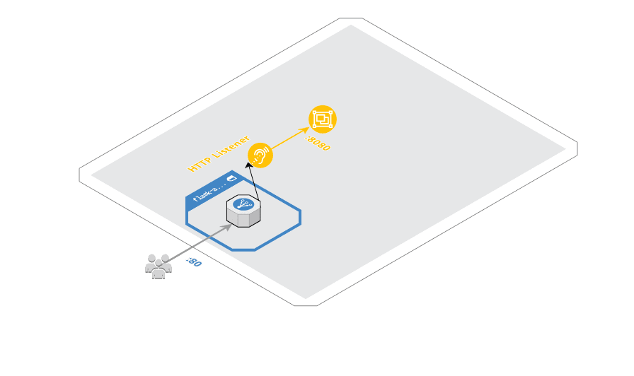
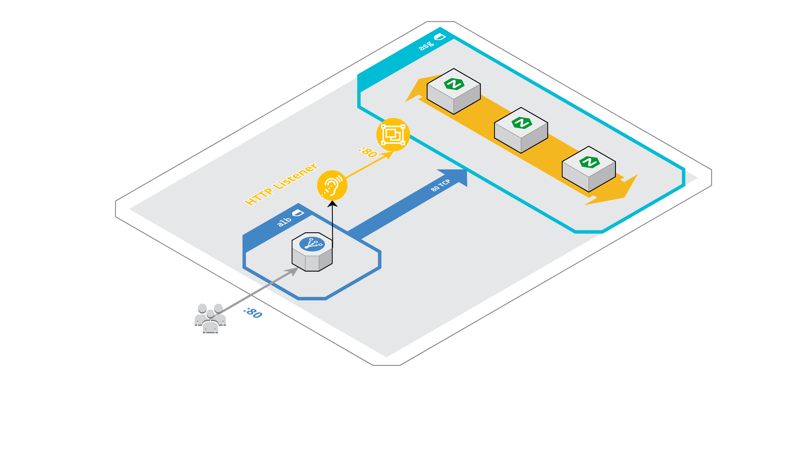

# Terraform AWS Autoscaling

## :triangular_ruler: Naming Convention

Common variables referenced in naming standards

| Variable              | RegExp                          | Example                                                     |
|:----------------------|:--------------------------------|:------------------------------------------------------------|
| `<availability_zone>` | `[a-z]{2}-[a-z]{1,}-[1-2][a-f]` | `us-east-1a`, `us-west-2c`, `eu-west-1a`, `ap-northeast-1c` |

---

## :triangular_ruler: AWS - Resource Naming Standards

* ALB

| AWS Resource        | Resource Naming          | Comment              | Example                                 |
|:--------------------|:-------------------------|:---------------------|:----------------------------------------|
| ALB                 | `<app_name>-alb-private` | Tag `Tier = private` | `web-api-alb-private`                   |
|                     | `<app_name>-alb-public`  | Tag `Tier = public`  | `web-api-alb-public`                    |
| ALB Target group    | `<app_name>-<protocol>`  |                      | `web-api-alb-http`, `web-api-alb-https` |
| ALB Security Groups | `<app_name>-alb`         |                      | `web-api-alb`                           |


* ASG

| AWS Resource        | Resource Naming             | Comment | Example                 |
|:--------------------|:----------------------------|:--------|:------------------------|
| ASG Security Groups | `<app_name>`                |         | `web-api`               |
| ASG Launch Config   | `<app_name>-lc-<timestamp>` |         | `web-api-lc-1537774225` |
| ASG Launch Template | `<app_name>-lt-<timestamp>` |         | `web-api-lt-1537774225` |

---

## :crystal_ball: Terraform Discovery module

If you followed the naming conventions listed in [terraform-aws-vpc](https://github.com/Lowess/terraform-aws-vpc) you will find it useful to use this [terraform-aws-discovery](https://github.com/Lowess/terraform-aws-discovery) module. The idea of using a discovery module is to centralize `datasource` usage in a central place and keep the source code DRY.

Here is an example usage:

```hcl
module "discovery" {
  source              = "github.com/Lowess/terraform-aws-discovery"
  aws_region          = var.aws_region
  vpc_name            = var.vpc_name
  ec2_ami_names       = ["<AMI-NAME>"]
  ec2_ami_owners      = "<TEACHER-ACCOUNT-ID>"
  ec2_security_groups = [...]
}
```

> :point_up: If you do not what to use this module you are free to redefine the datasources you need but keep in mind that you will be rebuilding the wheel :ferris_wheel:

---

## 1. Create an `AWS ALB`

Let's create an `ALB` and the related resources needed (security groups, listeners and target groups).

* [aws_lb](https://registry.terraform.io/providers/hashicorp/aws/latest/docs/resources/lb)
* [aws_lb_target_group](https://registry.terraform.io/providers/hashicorp/aws/latest/docs/resources/lb_target_group)
* [aws_lb_listener](https://registry.terraform.io/providers/hashicorp/aws/latest/docs/resources/lb_listener)
* [aws_security_group](https://registry.terraform.io/providers/hashicorp/aws/latest/docs/resources/security_group)
* [aws_security_group_rule](https://registry.terraform.io/providers/hashicorp/aws/latest/docs/resources/security_group_rule)



## 2. Create the `AWS Autoscaling group`

* [aws_security_group](https://registry.terraform.io/providers/hashicorp/aws/latest/docs/resources/security_group)
* [aws_security_group_rule](https://registry.terraform.io/providers/hashicorp/aws/latest/docs/resources/security_group_rule)
* [aws_launch_template](https://registry.terraform.io/providers/hashicorp/aws/latest/docs/resources/launch_template)
* [aws_autoscaling_group](https://registry.terraform.io/providers/hashicorp/aws/latest/docs/resources/autoscaling_group)
    * > :warning: Make sure you use `vpc_zone_identifier` and not `availability_zones`
    * > :warning: Use `min_size = 1` and `max_size = 2` as AWS educate sets limits on your accounts !



## [BONUS] 3. Create policies to make the `AWS Autoscaling group` scale in/out

* Visit the `Cloudwatch` service and discover what this service does

> :point_up: Think about what's the best metric to use in order to adjust the size of the Autoscaling group

* [aws_autoscaling_policy](https://registry.terraform.io/providers/hashicorp/aws/latest/docs/resources/autoscaling_policy)
    * > Define the scaling strategy (add / remove machines)
* [aws_cloudwatch_metric_alarm](https://registry.terraform.io/providers/hashicorp/aws/latest/docs/resources/cloudwatch_metric_alarm)
    * > Define an alarm that will trigger the autoscaling policy
