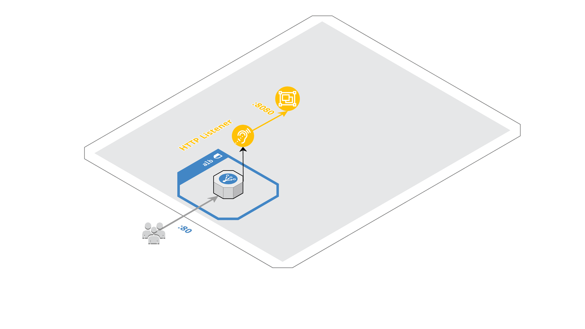

# Terraform AWS Autoscaling

## :triangular_ruler: Naming Convention

Common variables referenced in naming standards

| Variable              | RegExp                          | Example                                                     |
|:----------------------|:--------------------------------|:------------------------------------------------------------|
| `<availability_zone>` | `[a-z]{2}-[a-z]{1,}-[1-2][a-f]` | `us-east-1a`, `us-west-2c`, `eu-west-1a`, `ap-northeast-1c` |

---

## :triangular_ruler: AWS - Resource Naming Standards

* ALB

| AWS Resource        | Resource Naming          | Comment              | Example                                 |
|:--------------------|:-------------------------|:---------------------|:----------------------------------------|
| ALB                 | `<app_name>-alb-private` | Tag `Tier = private` | `web-api-alb-private`                   |
|                     | `<app_name>-alb-public`  | Tag `Tier = public`  | `web-api-alb-public`                    |
| ALB Target group    | `<app_name>-<protocol>`  |                      | `web-api-alb-http`, `web-api-alb-https` |
| ALB Security Groups | `<app_name>-alb`         |                      | `web-api-alb`                           |

* ASG

| AWS Resource        | Resource Naming             | Comment | Example                 |
|:--------------------|:----------------------------|:--------|:------------------------|
| ASG Security Groups | `<app_name>`                |         | `web-api`               |
| ASG Launch Config   | `<app_name>-lc-<timestamp>` |         | `web-api-lc-1537774225` |

## 1. Create an `ALB`

Let's create an `ALB` and the related resources needed (security groups, listeners and target groups).

* [aws_lb](https://www.terraform.io/docs/providers/aws/r/lb.html)
* [aws_lb_target_group](https://www.terraform.io/docs/providers/aws/r/lb_target_group.html)
* [aws_lb_listener](https://www.terraform.io/docs/providers/aws/r/lb_listener.html)
* [aws_security_group](https://www.terraform.io/docs/providers/aws/r/security_group.html)
* [aws_security_group_rule](https://www.terraform.io/docs/providers/aws/r/security_group_rule.html)

## 2. Create the `Autoscaling group`- ':house: In House' way

> :point_up: AWS Educate does not allow access to Autoscaling and Launch configuration services, In this example we will simulate autoscaling features by running multiple EC2 instances

* [aws_security_group](https://www.terraform.io/docs/providers/aws/r/security_group.html)
* [aws_security_group_rule](https://www.terraform.io/docs/providers/aws/r/security_group_rule.html)
* [aws_instance](https://www.terraform.io/docs/providers/aws/r/instance.html)
* [aws_lb_target_group_attachment](https://www.terraform.io/docs/providers/aws/r/lb_target_group_attachment.html)

## 3. Add monitoring and create an `Autoscaling` script - ':house: In House' way

> :muscle: It's now on you to figure out a logic to implement scale up / scale down actions on your `autoscaling group`

> :point_up:

*Based on [standard module structure](https://www.terraform.io/docs/modules/create.html#standard-module-structure) guidelines*
